# Démontage des panneaux de porte sur une Renault Avantime

## Matériel nécessaire
Les outils suivants sont nécessaires :

- clés torx de 20 et 30  
- un petit tournevis plat (0.4 x 2.5)
- un gros tournevis plat
- une spatule / un couteau de peintre
- une clé à pipe / douille de 10
- un petit pot pour mettre les vis au fur et à mesure du démontage
- un pistolet à cartouche

## Liste des consommables à acheter

- Une cartouche de colle [SikaLastomer-710](https://fra.sika.com/fr/groupe/publications/technologie-sika/butyles/sikalastomer--710.html)

## Démontage

### 0. Avertissement

Une fois les panneaux de portière démontés, le mécanisme du lève vitre sera accessible sans protection.
Il y a un risque de perdre un doigt si le lève vitre est activé et que vos doigts trainent quelque part sur le mécanisme.

**Dès lors, il est fortement recommandé de débrancher la batterie avant de commencer à démonter les panneaux de porte.**

Pensez juste à ouvrir les portes avant de débrancher la batterie car celles-ci ne peuvent s'ouvrir que lorsque la batterie est branchée !

### 1. Déposer les 4 vis du bas de porte

Il y a quatre vis torx à dévisser.

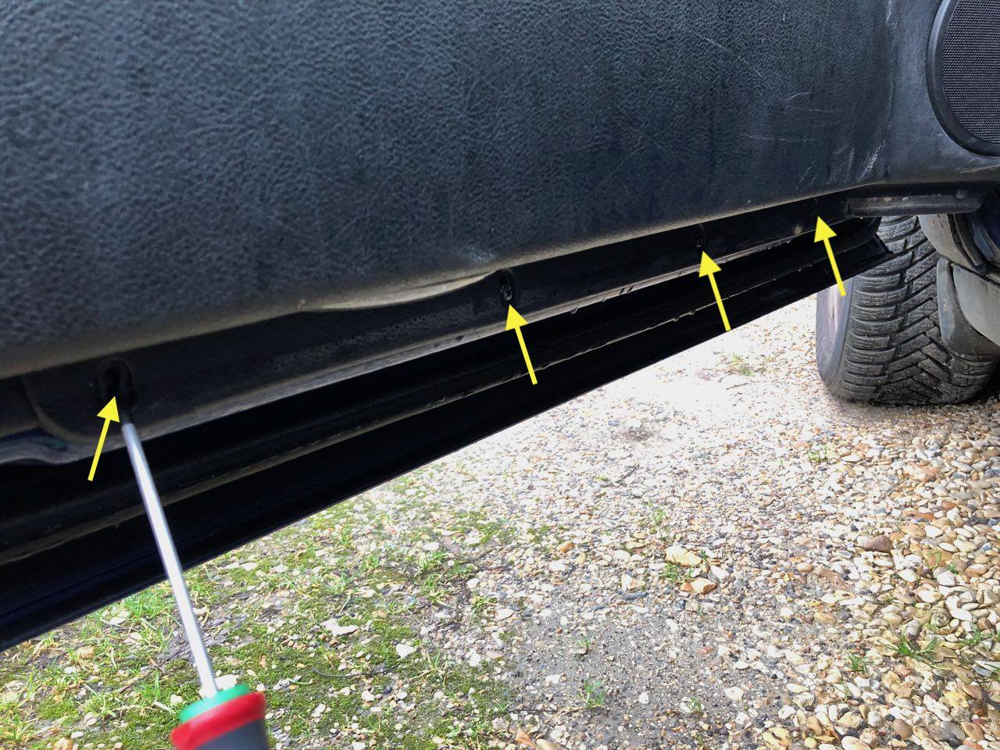

### 2. Déposer la poignée de porte

Il faut enlever le cache de la poignée de porte avec un petit tournevis plat ou à la main car il est juste clipsé.

Dévisser les deux boulons de 10 à l'aide d'une clé à pipe ou douille.

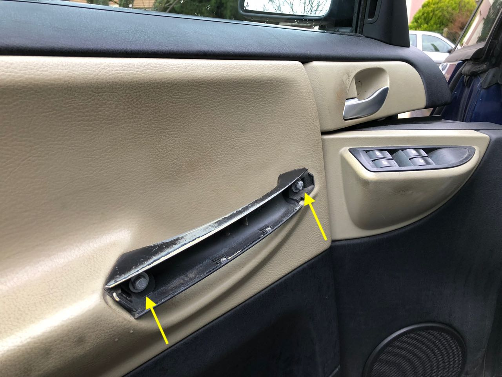

### 3. Déposer le cache trianglulaire

Il y a une vis torx sur le dessus et il vient ensuite à la main.

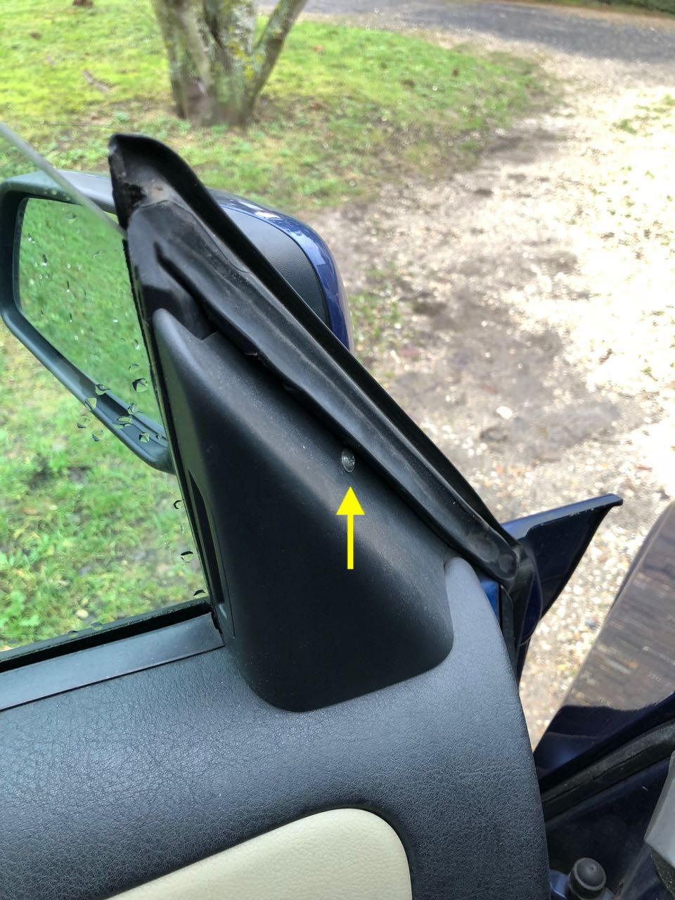

### 4. Déposer le cache de la poignée de porte

Il faut enlever délicatement le cache-vis rond à l'aide d'un petit tournevis plat et devisser la vis torx qui est derrière.

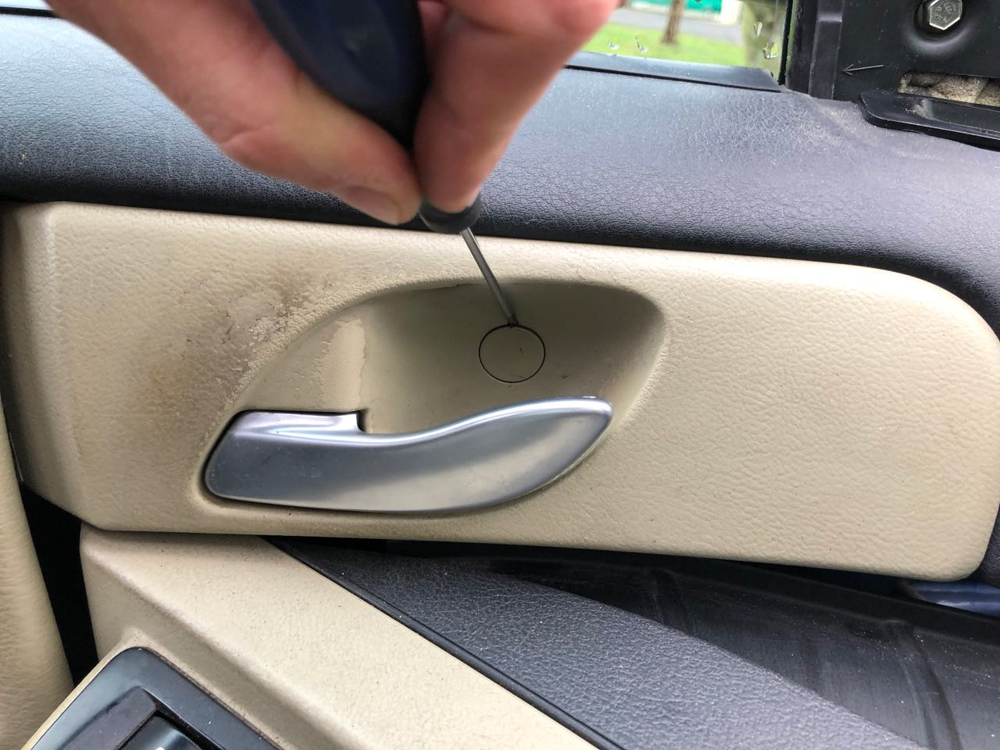
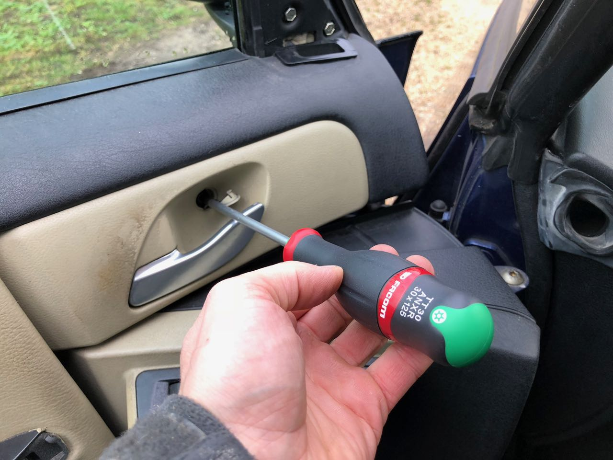

Une fois le cache déposé, il faut enlever la vis qui est derrière.

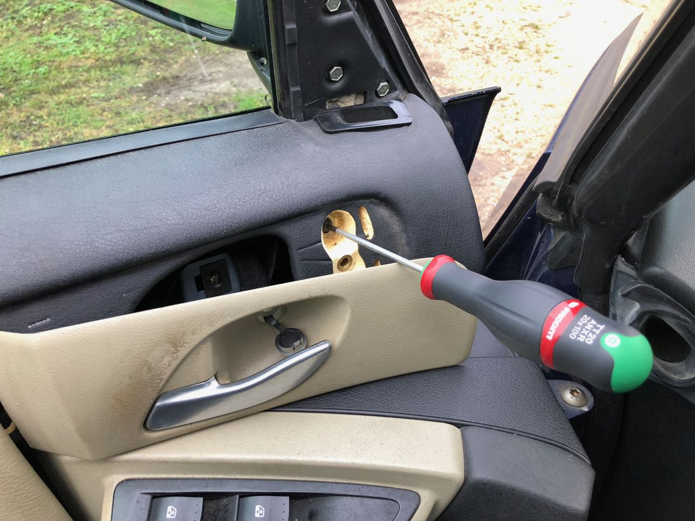

### 5. Déposer le séparateur du vide poche

Il y a un cache en plastique à enlever à l'aide d'un gros tournevis plat.

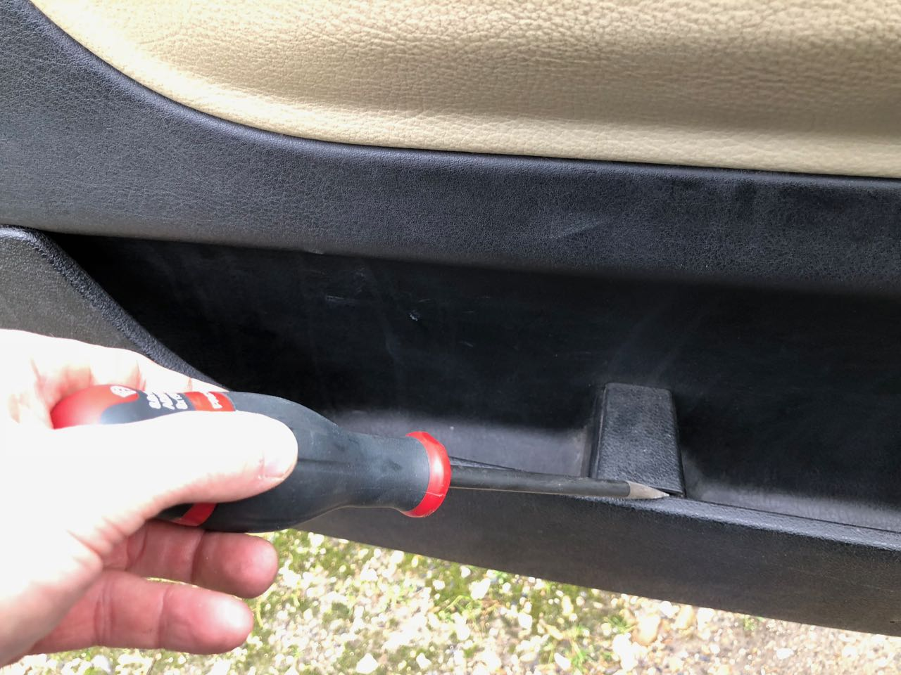

Une fois le cache enlevé, il faut dévisser la vis qui est au fond.

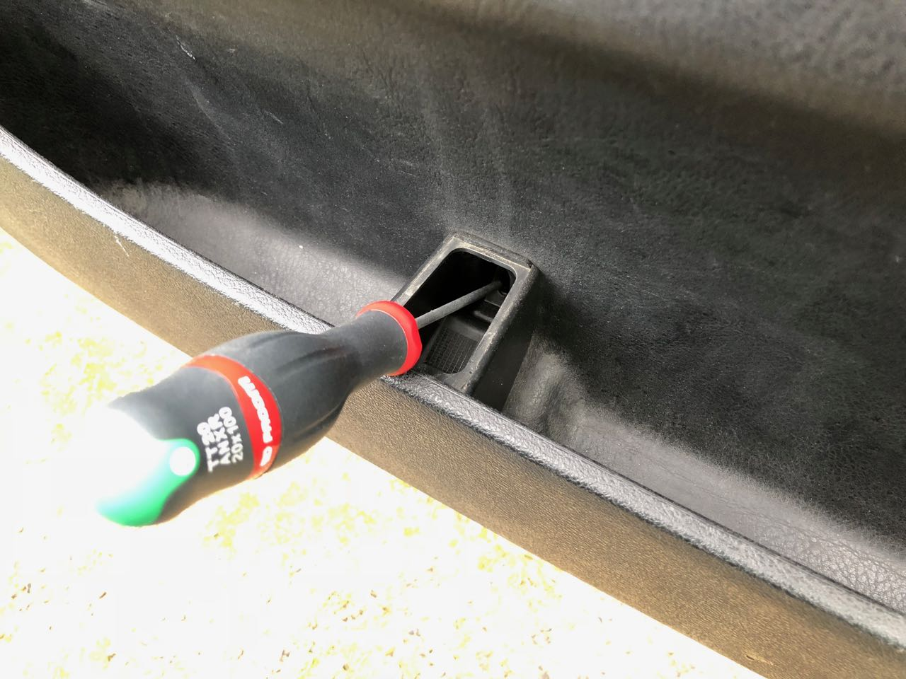

### 6. Déposer le panneau de porte

Soulever le panneau de porte et le déposer. Pensez à déconnecter la fiche de l'éclairage.

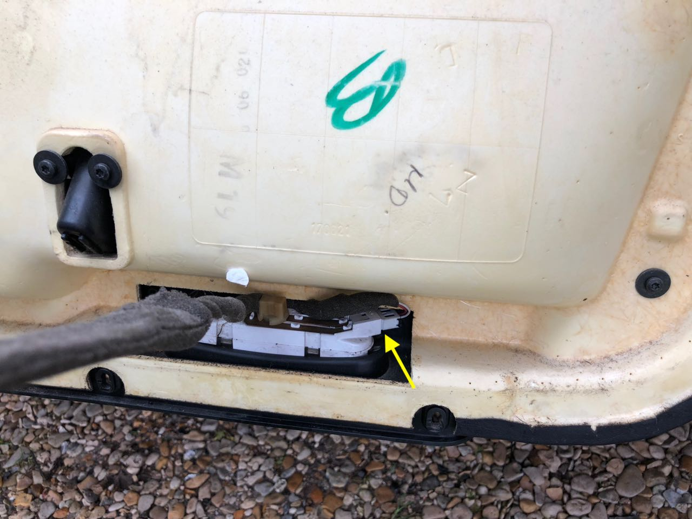

### 7. Accès au mécanisme du lève vitre

Enlever les quatre vis de la platine noire et la déposer.

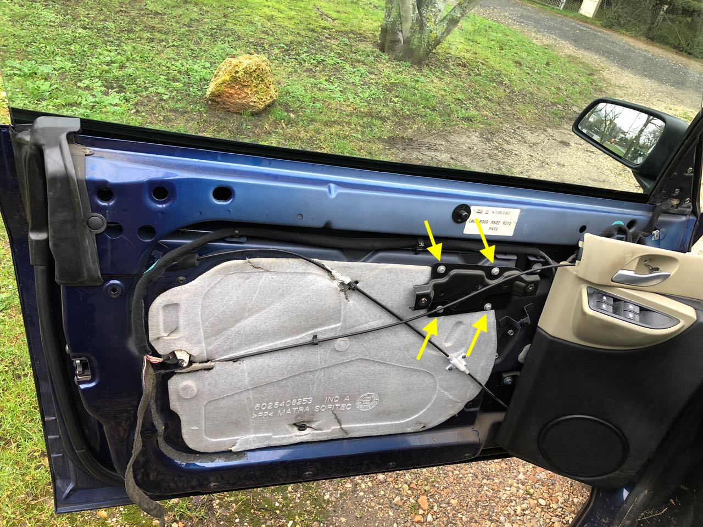

Déposer les clips et vis qui tiennent les deux cables qui actionnent le verrouillage/déverrouillage des serrures.

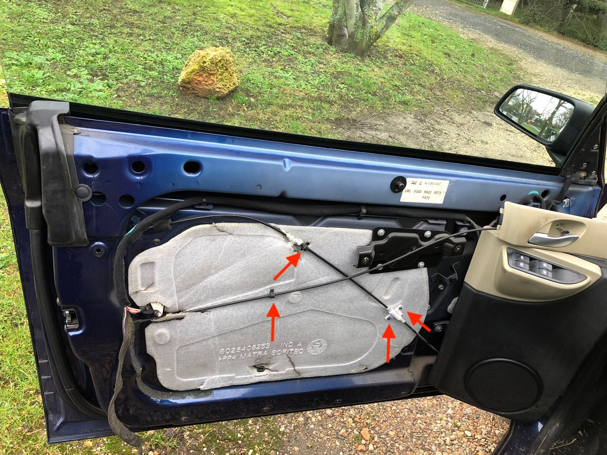

A l'aide d'une spatule, décoller la feuille de propreté de la portière.
Ne pas abîmer la feuille en polystirène car idéalement il faudra la reposer !

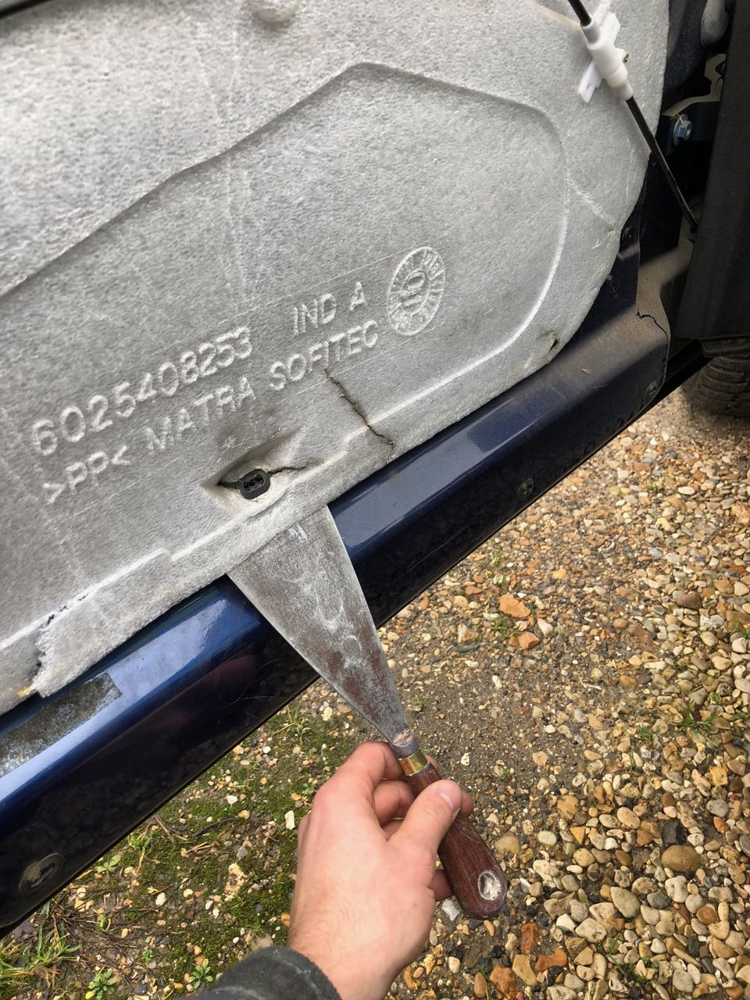

## Remontage

TODO
