# Remplacement des triangles sur une Renault Avantime

## Symptômes
Les triangles sont à changer quand :
- vous entendez un bruit sourd à la descente d'un dos d'âne
- vous entendez un "cloc-cloc" lorsque vous freinez légèrement à basse vitesse
- ça vibre dans le volant quand vous accélérez fortement ou au freinage
- le contrôle technique signale un jeu important sur le demi-train avant

## Matériel nécessaire
En plus du matériel courant, les outils suivants sont nécessaires :
- une grande rallonge d'un mètre pour désserrer les écrous bien serrés
- une clé dynamométrique (plage TODO à 210 N.m)
- deux clés/douilles de 22 **à 12 pans**. C'est très courant, les douilles classiques 6 pans ont déjà en général 12 pans. Chez Facom la référence est `S.22`. Dans le cas présent, j'avais une douille Magnusson de 22 et une clé à pipe Facom de 22 également. 
- un jeu de chasses rotules à frapper (références `670.0091`, `670.0092` et `670.0094` chez KS.Tools)

**Note: Se faire aider d'une deuxième personne n'est pas du luxe.**

## Liste des pièces à acheter

- Un triangle coté conduteur (référence RENAULT : 6025305572 - 6025307649)
- Un triangle coté passager (référence RENAULT : 6025305573 - 6025307650)
- Deux boulons de 22 (référence RENAULT : 8201084688)
- Deux écrous de 22 (référence RENAULT : 7700802227)

**Note: Les écrous et boulons de 18 qu'il faudrait en théorie remplacer à chaque changement de triangle ne sont plus fabriqués par Renault.** 

## Mode opératoire

### 1. Lever et mettre le véhicule sur chandelles

Il est impératif de lever **les deux roues** du véhicule, même si vous ne changez qu'un coté. En effet, il faudra déconnecter la biellette de barre stabilisatrice et vous ne pourrez pas le faire si une des roues repose encore sur le sol. 

Vous pouvez placer les chandelles sur les longerons, en intercalant une petite planche de bois pour ne pas marquer :

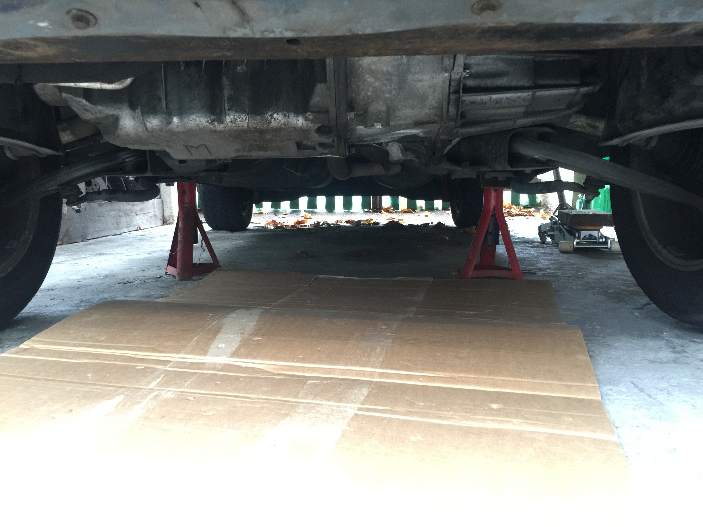

### 2. Déposer la roue

Désserrer les écrous de roue et déposer la roue. 

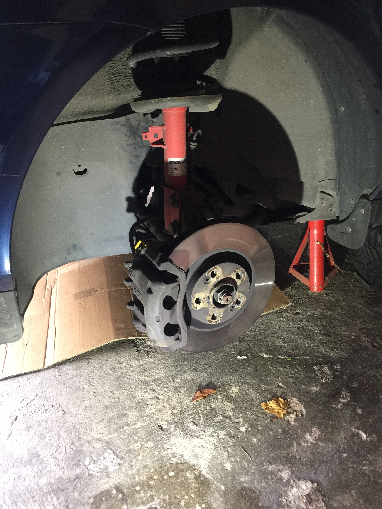

On peut voir l'un des *silent block* du triangle dans un état moyen. Pour le triangle gauche et droit, c'est le *silent block* du fond, celui qui est caché, qui était le plus abimé. 

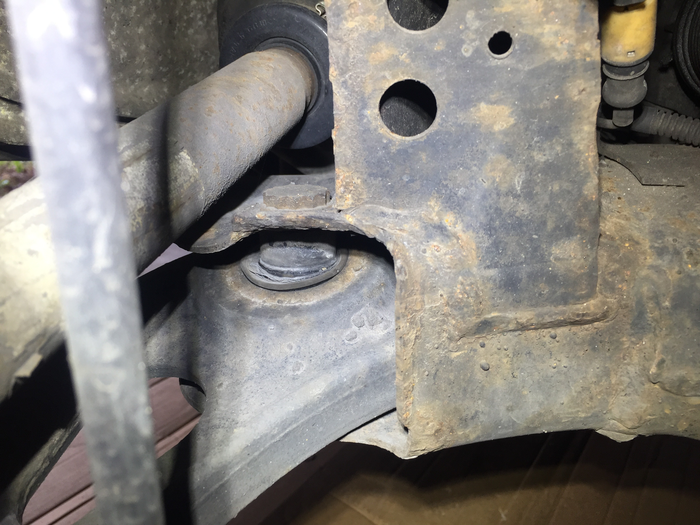

### 3. Déconnecter la biellette de barre stabilisatrice

La biellette est connectée en haut à l'amortisseur et en bas à la barre anti-roulis. Utiliser une clé plate de 17 et une clé BTR pour l'empêcher de tourner. 

Déposer la biellette.

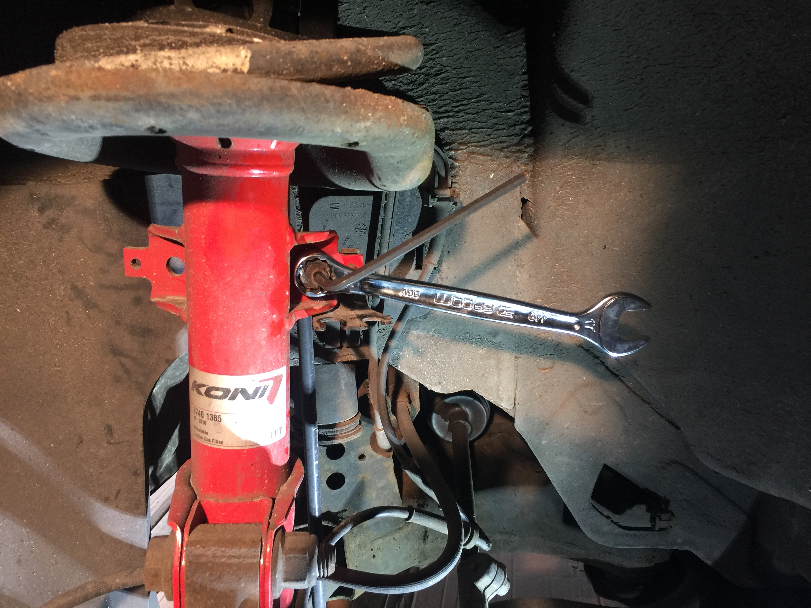

### 4. Détacher le cable du capteur ABS et le flexible de frein

Détacher le câble du capteur ABS et le flexible de frein. Ils sont clipsés sur le pied de l'amortisseur. 

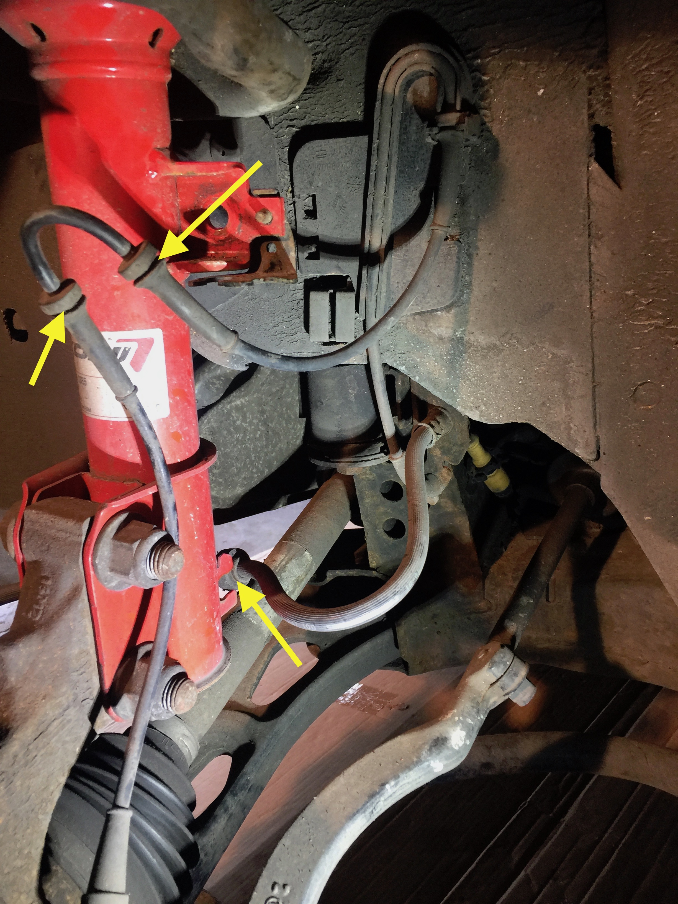
 
### 5. Dévisser les deux vis du pied de l'amortisseur

Utilisez une douille de 24 et et la rallonge car c'est serré fort !

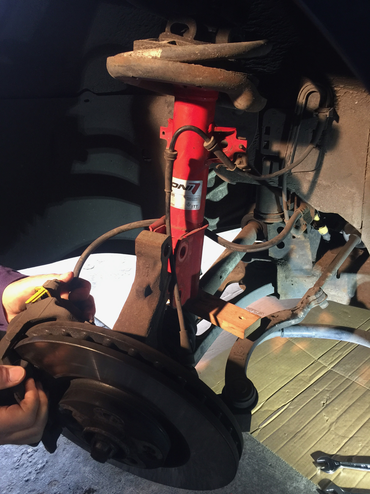

### 6. Sortir l'amortisseur

Cette étape est optionnelle mais vu la facilité à sortir l'amortisseur une fois arrivé là et la place libérée, c'est une bonne option. 

Dévisser les trois vis qui tiennent la tête de l'amortisseur. Elles sont dans le compartiment où se trouve le fitre habitacle (coté gauche, c'est derrière les bras d'essuie glace). 

Utiliser une douille de 13 et un (petit) cliquet.

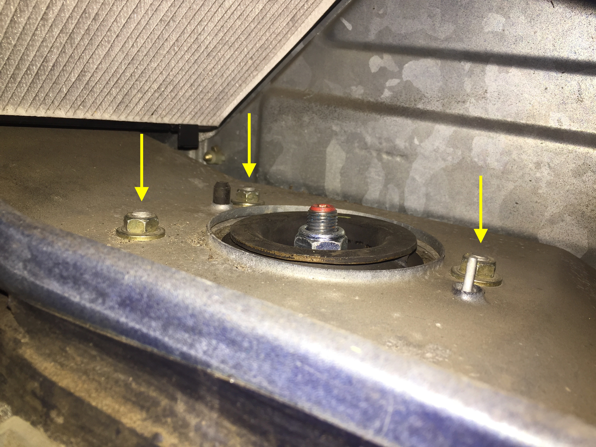

Sortir l'amortisseur. 

En profiter pour accrocher la fusée à un fil de fer pour éviter qu'elle ne bascule / tombe. 

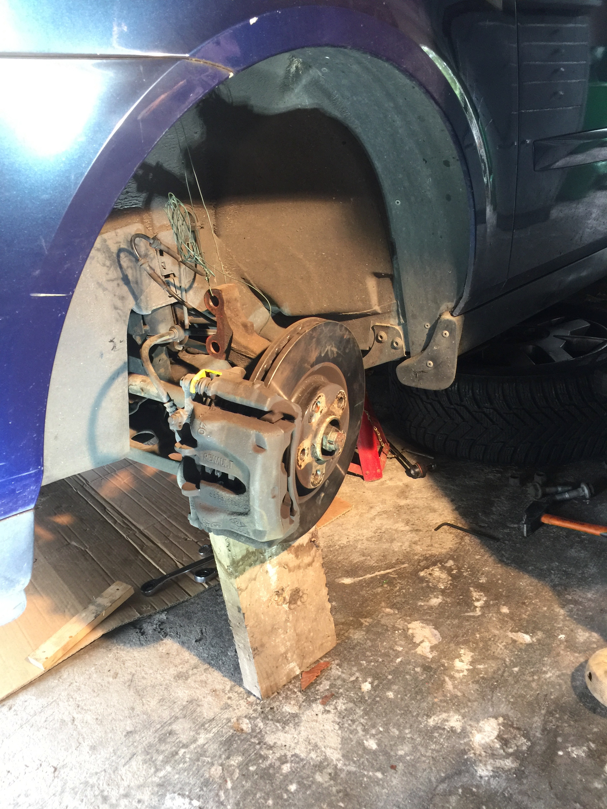

### 7. Démonter la rotule de suspension

La rotule de suspension est au bout du triangle. L'écrou est pris en sandwich entre le triangle et la couronne du capteur ABS. Faire extrèmement attention à ne pas abîmer la couronne. 

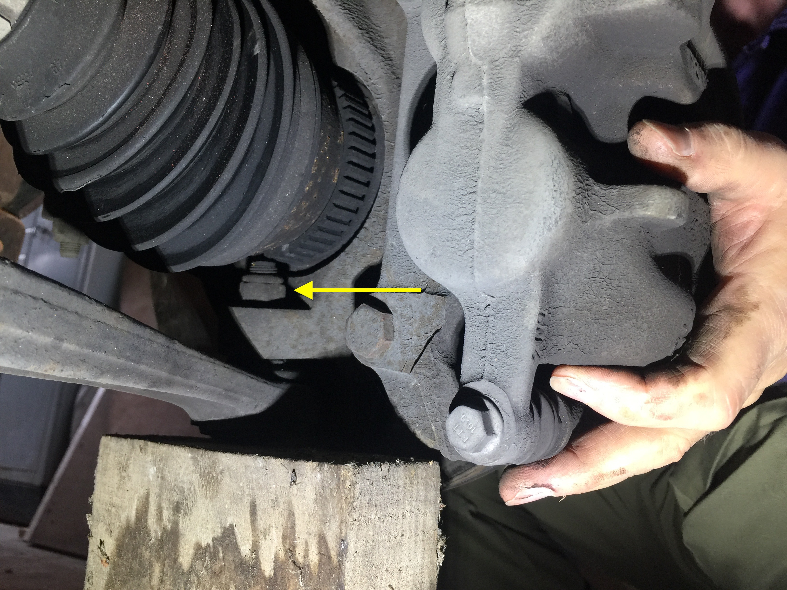

L'écrou se dévisse avec une clé plate de 18 (et se remonte avec une clé de 19...). 

Une fois l'écrou désserré, pour le sortir complètement il faut décoller la rotule. Utiliser pour cela un chasse rotule à frapper. 

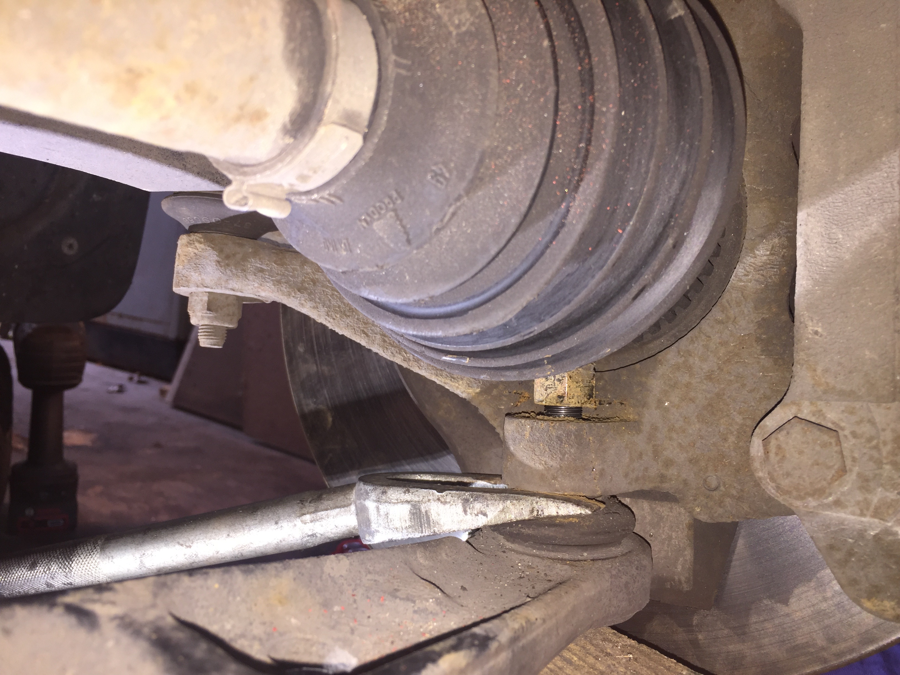

Une fois décollée, la rotule tournera librement. Pour finir de dévisser son écrou, il faut la maintenir à l'aide d'une pince étau. **Attention: sur un des deux triangles, l'écrou était monté au frein filet. Il nous a fallu une grosse pince étau pour tenir correctement la rotule.**
 
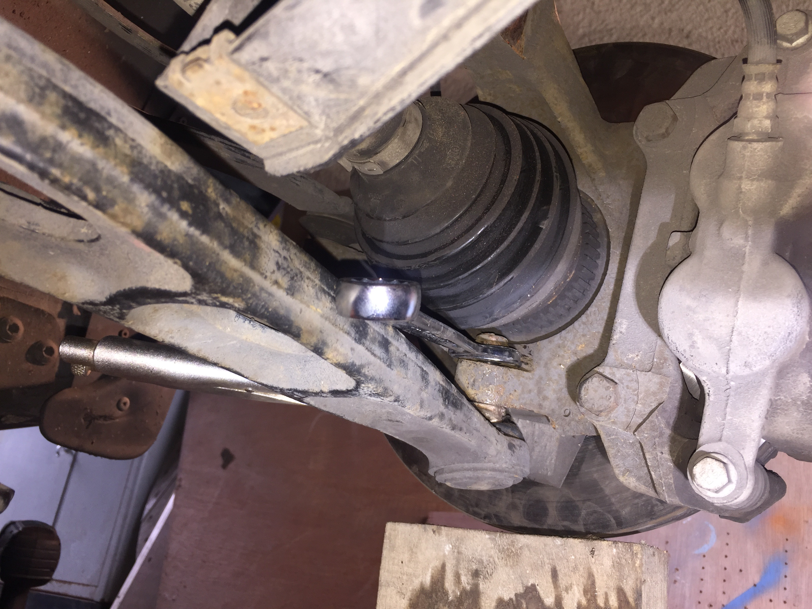

Lever la fusée pour dégager la rotule. 

### 7. Dévisser les deux fixations du triangle

Le triangle est maintenu par deux fixations (A et B sur le schéma ci-dessous). **Attention, la fixation arrière est un peu contre-intuitive: il s'agit du même boulon qui tient la barre anti-roulis**.

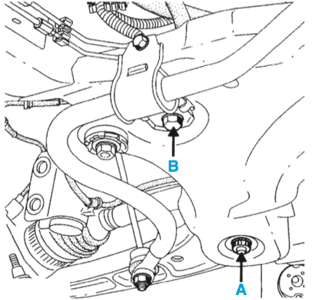

Fixation de devant: immobiliser la douille/clé de 22 pour bloquer l'écrou et l'autre clé/douille de 22 pour désserrer (en utilisant la rallonge, c'est serré fort).

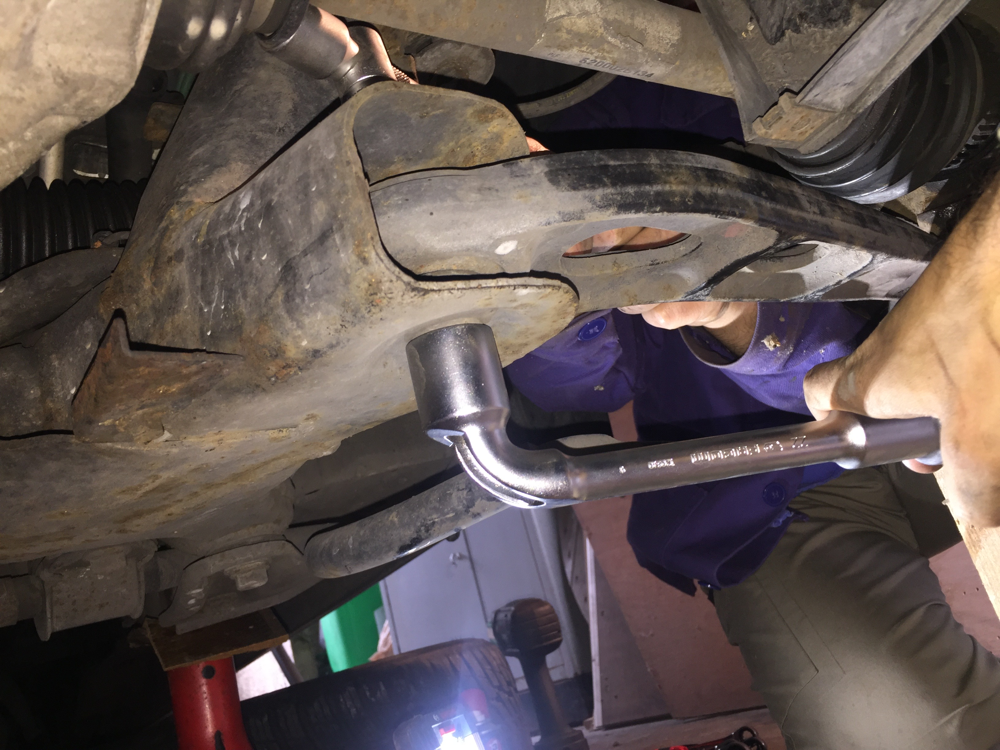

Fixation de derrière: même mode opératoire mais avec la clé/douille de 18. 

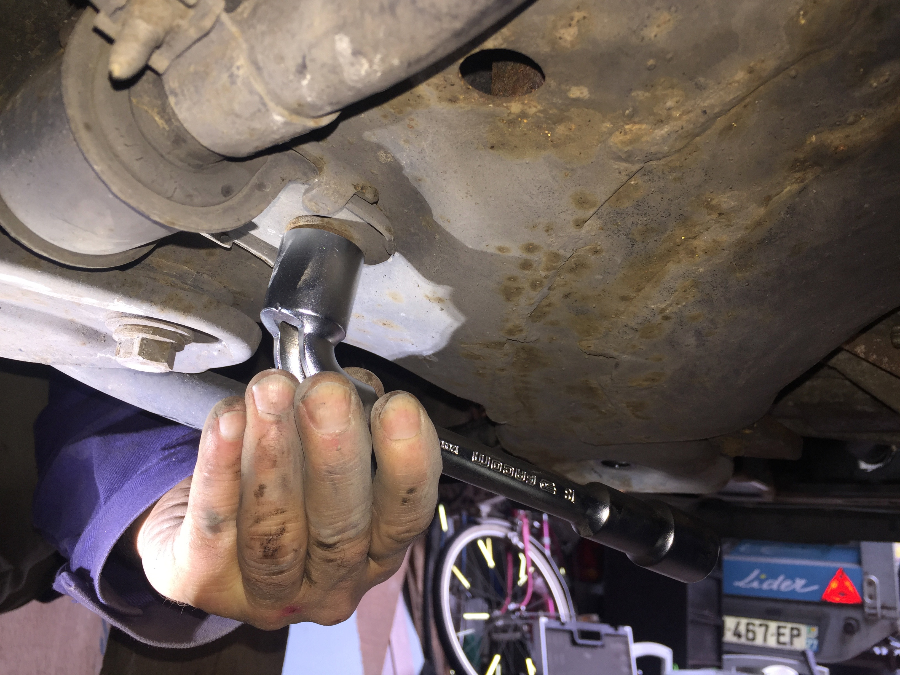

Le triangle sort sans problème par devant.

### 8. Remontage du nouveau triangle

Positionner le nouveau triangle de la manière suivante :
 - Positionner grossièrement le triangle
 - Insérer la vis de la rotule dans la fusée et visser sommairement l'écrou
 - Aligner la fixation avant avec le trou avant, insérer le boulon de 22 (neuf), par le dessus. Ne pas mettre l'écrou tout de suite, pour se garder un peu de jeu.
 - Aligner la fixation arrière avec le trou arrière et insérer le boulon de 18, par le dessous. **Note: monter-descendre le couple triangle-fusée peut aider.**

 - Visser l'écrou de 18 par le dessus
 - Positionner l'écrou de 22, tapotter avec un maillet pour qu'il rentre dans son logement. **Note: monter-descendre le couple triangle-fusée peut aider.**
 - Serrer le boulon de 18, l'écrou de 22 au couple. **Il faut le faire maintenant car quand l'amortisseur sera remonté, le triangle sera en effort et le boulon de 18 ne pourra plus être serré au couple** (ça a encore été bien conçu ce truc là).
 - Serrer l'écrou de fixation de la rotule. Il n'est pas possible d'y passer la clé dynamométrique donc un serrage approximatif. 

La suite du remontage s'effectue à l'inverse de la dépose. 

Couples de serrage des fixations du triangle :
 - écrou de 22: 210 N.m
 - écrou de 18: 120 N.m

Le pied de l'amortisseur est à serrer à 200 N.m, les trois vis qui tiennent le haut de l'amortisseur sont a serrer à 25 N.m et les écrous de la biellette de barre stabilisatrice sont à serrer à 40 N.m. 

La totalite des couples de serrage sont listés ici en daN.m :

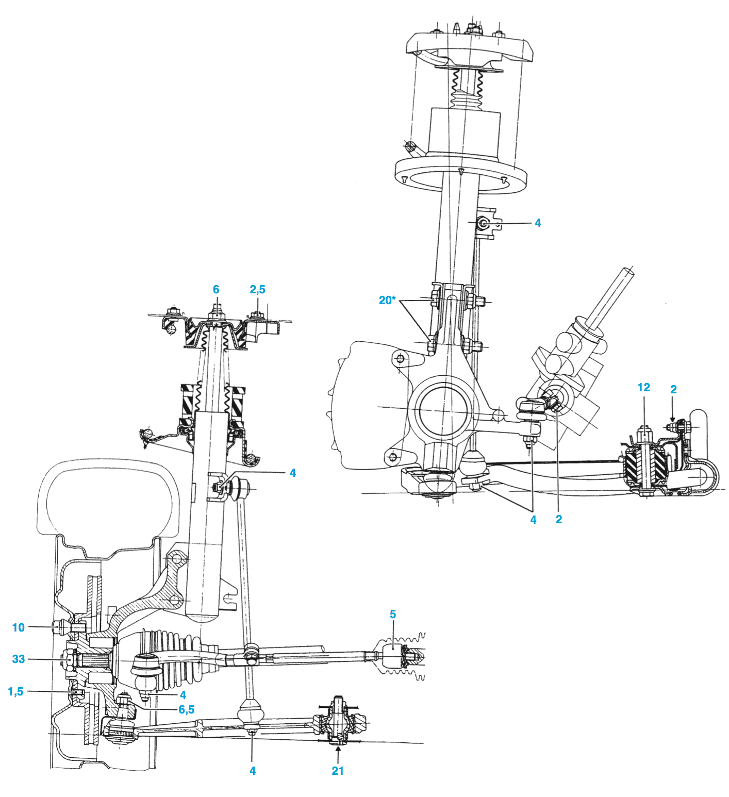

### 9. Vérifications

Vérifier que : 
 - les fixations du triangle sont serrées au couple
 - les vis du pied de l'amortisseur sont serrée au couple
 - l'écrou de la rotule est vissée et correctement serrée
 - les deux écrous de la biellette de barre stabilisatrice sont serrés au couple
 - les écrous qui tiennent le haut de l'amortisseur sont serrés au couple
 - le flexible de frein et le câble du capteur ABS sont re-fixés sur le pied de l'amortisseur
 - les écrous de roue sont serrés

 
