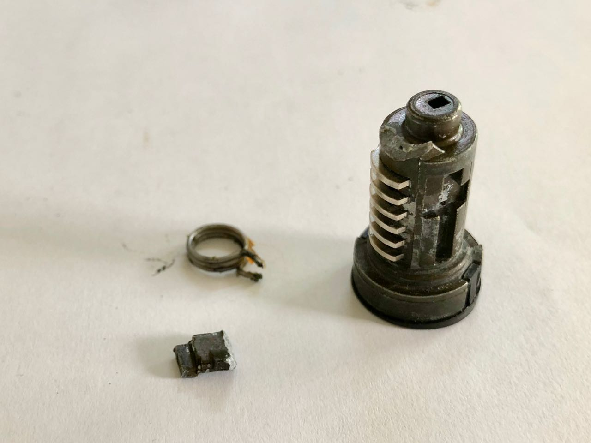
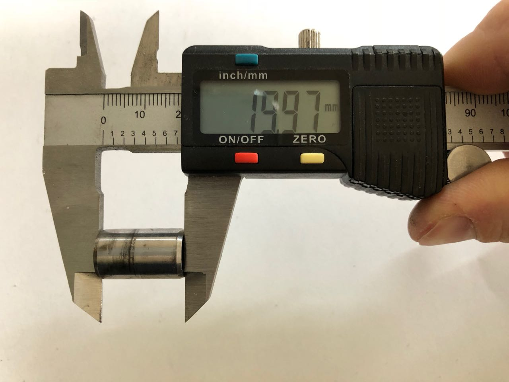

# Réparation de la serrure de portière d'une Renault Avantime

## Symptômes

Parfois lorsque la télécommande qui permet de verrouiller/déverrouiller les portes
tombe en panne, plutôt que de faire réparer la télécommande, on utilise la serrure
pour ouvrir la portière.

Hé bien, c'est une bien mauvaise idée !

La serrure de l'avantime a l'air plutôt fragile de conception et pourrait bien vous
lâcher un jour ou l'autre.

Lorsque la serrure casse, le barillet vous reste dans les mains avec la clé et si
la serrure n'est pas déverrouillée, il n'est plus possible d'ouvrir la portière.

Si vous avez encore la télécommande, ouvrez la portière avec celle-ci. Dans le cas
contraire, il faut ouvrir la portière comme le ferait un voleur...

Si heureusement la portière s'est déverrouillée avant de casser, vous avez de la
chance, il vous suffira de la réparer !

Le barillet ressemble à ça :

La petite pièce qui entraîne le mécanisme de la serrure est cassée :

## Matériel nécessaire

En plus du matériel nécessaire pour [démonter les panneaux de porte](../Demontage-des-panneaux-de-porte/README.md), il vous faudra :

- une Dremel
- une lime
- un pied à coulisse
- un marqueur fin
- un petit tournevis
- une pince à ressort pour tenir les pièces pendant le collage
- une toute petite pince étau pour tenir les pièces pendant le collage (ou pince équivalente)

## Liste des consommables à acheter

- de la colle bi-composant, type Araldite ou [Cyanolit Puissance +](https://www.cyanolit-colles.com/produits/colle-puissance-plus/).
- de l'huile grafitée pour serrures
- une bombe de nettoyant frein

## 1. Démontage

### 1.1. Démonter les panneaux de porte

[Démonter les panneaux de porte en suivant les instructions ici](../Demontage-des-panneaux-de-porte/README.md).

### 1.2. Démonter la platine qui tient la serrure

Une fois les panneaux de porte démontés, il faut enlever la vis qui tient la platine noire de la serrure.

Sortir la platine en la tirant vers le bas et en la penchant sur le coté.

La serrure sort à la main __par l'extérieur__.

## 2. Composition de la serrure et mode de fonctionnement

La serrure se compose des différentes pièces suivantes :

1. Corps de la serrure
2. Stator
3. Rotor ou barillet
4. Ressort de rappel
5. Goupille
6. Lame et pointeau

Le corps de la serrure accueille le stator et dispose en son fond d'un mécanisme de levier
pour actionner la gâche lorsque la clé est tournée.

Le mécanisme permet en actionnant l'oeil de faire bouger la gâche **si et seulement si
l'axe de rotation entouré en rouge sur la photo est maintenu fixe**. C'est une protection
pour éviter que quelqu'un forçant la serrure avec un tournevis ou un forceur ne puisse
actionner la gâche car dans ce cas l'axe de rotation tournerait en même temps que l'oeil,
et la gâche resterait fixe.

L'axe de rotation est maintenu fixe grâce au stator qui dispose d'un trou dans lequel vient
se loger l'axe de rotation du levier.

Le stator vient se positionner dans le corps de la serrure grace à un pointeau et une
lame qui joue le role de ressort.

Le corps de la serrure présente une rainure dans laquelle vient se placer le pointeau.

Le rôle du pointeau est d'empêcher, lors du fonctionnement normal de la serrrure,
le barillet de tourner dans le corps de la serrure.
La lame, qui joue un rôle de ressort, permet de plaquer le pointeau dans la rainure et donc
dans les conditions normales d'utilisation le stator et le corps sont fixes.
L'intérêt d'un tel type de montage est de permettre au stator de tourner dans le corps
de la serrure lorsqu'un voleur tente de forcer la serrure.

Ainsi, les paillettes du barillet ne seront pas endommagées et vu que l'axe de rotation
du levier tournera en même temps que l'oeil du levier, la gâche restera fixe malgré la
rotation du stator dans le corps de la serrure.

Le stator est maintenu en place dans le corps de la serrure à l'aide d'une goupille.
La goupille vient s'insérer dans la rainure circulaire qui se trouve sur le pourtour
du stator.

Le stator peut ainsi tourner dans le corps de la serrure si celle-ci est en train
d'être forcée par un voleur mais ne peut pas sortir si on essaye d'arracher la serrure.

Le barillet vient s'insérer dans le stator. Les [paillettes](https://www.lockpickingfrance.org/serrures-a-pailletes.html)
permettent de rendre le barillet et le stator solidaires tant que la bonne clé
n'est pas insérée dans la serrure.

Un ressort de rappel permet de ramener le barillet dans sa position neutre. Les deux
pattes du ressort de rappel viennent se positionner de part et d'autre de la petite
patte du stator :

## 3. Réparation de la partie cassée

Pour remplacer la partie cassée, nous allons fabriquer une petite pièce en métal qui viendra
prendre un appui plus large sur le barillet et qui devrait être plus solide.

Le rôle de la petite patte dessous est de prendre appui sur le barillet pour transmettre le
mouvement de rotation du barillet à la gâche au moyen de notre petite pièce.

La grande patte en haut permet de transmettre le mouvement de rotation imprimé par le barillet
au levier qui est dans le corps de la serrure pour in fine actionner la gâche.

L'excroissance sur la patte en haut permet au barillet de ne pas sortir du stator lorsque l'on
retire la clé de la serrure.

Et les deux échancrures, sur le pourtour de part et d'autre de la grande patte, servent
à faire coulisser les deux pattes du ressort de rappel lorsque le barillet tourne.

[Le plan sketchup est disponible ici.](piece.skp)

## 3.1. Matériel nécessaire

Pour fabriquer cette petite pièce, il vous faudra un morceau de tube métallique
de même diamètre que le corps du barillet (12mm). Le matériaux le plus facilement et le plus
largement disponible pour cet usage est le tube de cuivre écroui pour la plomberie.

Pour ma part, j'avais dans ma réserve de pièce une petite entretoise en acier du bon diamètre.
J'ai opté pour cette solution.

## 3.2. Préparation du barillet

Afin de permettre à la petite patte de notre pièce de prendre appui sur le barillet,
il faut prolonger la rainure existante sur le barillet jusqu'au bout.

Pour cela, utiliser une dremel. Le barillet avant:

Le barillet après :

En profiter également pour nettoyer l'endroit de la cassure à la dremel...

## 3.3. Réalisation de la petite patte

A la dremel, découper le tube pour réaliser la petite patte, de hauteur 3mm et de
même largeur que la rainure réalisée dans le barillet (environ 2,5mm).

## 3.3. Réalisation de la grande patte

Tracer sur la pièce les cotes de la grande patte (largeur, hauteur). **Attention
à l'orientation des deux pattes dans l'espace.** Les milieus des deux pattes sont
séparés d'un quart de tour. Se référer à la photo pour repérer le sens !

Sur la photo, la largeur (4.8mm) a été tracée au marqueur fin et la hauteur a été tracée
au trusquin.

Découper à la dremel la grande patte.

## 3.4. Réalisation des deux échancrures

Réaliser les deux échancrures de chaque coté de la grande patte, sur le pourtour de la pièce,
pour l'une en dessous de la pièce et pour l'autre, au dessus.

Se référer au plan pour ne pas se tromper de dimension ! Découper les échancrures à la Dremel.

## 3.5. Collage de la pièce sur le barillet

La pièce réalisée doit être solidaire du barillet, c'est pourquoi il est nécessaire de réaliser un collage.

Les endroits à coller sont :

 - la petite patte (collée avec la rainure dans le barillet)
 - tout le pourtour inférieur de la pièce, échancrure exclue (collée avec le pourtour du barillet)

La première étape du collage est de réaliser un chanfrein sur le pourtour de la pièce et le pourtour du barillet
afin d'augmenter la surface de contact et d'avoir une bonne accroche. Utiliser la Dremel pour cela.

Pour le collage en lui-même, utiliser une colle bi-composant de type Araldite ou Cyanolit.
Bien dégraisser la pièce et le barillet avant, à l'aide d'une bombe de nettoyant frein.
Maintenir les pièces pendant le collage (24h à 48h) à l'aide d'une pince à ressort.

Une fois le collage sec, éliminer les sur-épaisseurs à l'aide d'une lime.

## 3.6. Réalisation de l'excroissance sur la grande patte

Dans une des chûtes de tube, découper une petite pièce carrée de hauteur 4mm et de
même largeur que la grande patte (4.8mm).

## 3.7. Collage de l'excroissance sur la grande patte

L'excroissance doit être collée sur la grande patte pour permettre au barillet de
rester en place lorsque l'on retire la clé de la serrure.

Pour cela, l'excroissance doit être collée en position, barillet dans le stator :

 - Insérer la clé dans le barillet
 - Insérer le tout dans le stator
 - Aligner la grande patte avec la patte du stator (où viennent se loger les deux pattes du ressort de rappel)
 - Retirer la clé du barillet

Une fois la clé retirée, les paillettes retiennent le barillet et le stator dans la bonne position.

Il faut alors coller l'excroissance sur notre pièce de telle manière qu'elle vienne
reposer sur la patte du stator:

Pour le collage en lui-même, utiliser une colle bi-composant de type Araldite ou Cyanolit.
Bien dégraisser la pièce et le barillet avant, à l'aide d'une bombe de nettoyant frein.
Maintenir les pièces pendant le collage (24h à 48h) à l'aide d'une petite pince étau
(ou petite pince à ressort).

**Faire bien attention à ne pas coller le barillet et le stator ensemble !**

Une fois le collage sec, éliminer les sur-épaisseurs à l'aide d'une lime.

## 3.8. Remontage de la serrure

Pour le remontage, procéder ainsi :

1. Déposer un peu d'huile grafitée aux endroits de friction : sur le pourtour de
   la pièce, à l'extrémité de la grande patte, sur les deux échancrures
2. Déposer le ressort de rappel sur le bout du barillet
   
3. Mettre la clé dans le barillet
4. Insérer le barillet dans le stator (attention, il y a une position pour le rentrer
   maintenant que l'excroissance à été collée)
5. Au bout du stator, récupérer la patte supérieure du ressort de rappel avec
   un petit tournevis et la positionner de l'autre coté de la grande patte.
   
   
6. Enfoncer à fond le barillet dans le stator
7. Récupérer à nouveau la patte supérieure du ressort de rappel avec
   un petit tournevis et la positionner de l'autre coté de la patte du stator.
   
8. Vérifier que la clé rentre et sort librement sans accrocher.
9. Vérifier que la clé peut tourner d'un coté et de l'autre et qu'elle revient
   en place toute seule. Vérifier qu'en position neutre (position imprimée par
   le ressort de rappel), la clé sort librement.
10. Positionner la lame et le pointeau dans leur emplacement (la lame est dans
    le pointeau et **attention, la lame à un sens lié à sa courbure**)
    
11. Positionner à l'aide d'un petit tournevis l'axe du levier dans le corps de la
    serrure. Lorsqu'il est en position, il doit être visible par la petite fenêtre
    sur le coté. Positionner l'oeil du levier bien en face.
    
12. Enfoncer l'ensemble barillet-stator-lame-pointeau dans le corps de la serrure,
    le pointeau bien aligné avec sa rainure.
13. Mettre la goupille en place
14. Remettre la clé et vérifier que la serrure fonctionne.

## 3.9. Dernières remarques

L'excroissance collée n'est pas strictement nécessaire. En effet, le barillet tient
assez bien tout seul à l'aide des pattes du ressort de rappel. En revanche, dans
ce cas la précision d'assemblage n'est pas suffisante pour permettre à la clé de sortir
(les paillettes du barillets ne s'alignent pas avec les trous du stator), il faut
alors tenir le barillet pour pouvoir sortir la clé.

# 4. Remontage

La serrure s'insère par l'extérieur en faisant attention à bien aligner le trou
de la gâche avec le pion qui est sur le levier dans la portière.

Remettre la platine noire qui tient la serrure, par l'intérieur de la portière et
la refixer avec sa vis.

[Le reste du remontage s'effectue à l'inverse de la dépose comme décrit ici.](../Demontage-des-panneaux-de-porte/README.md)
